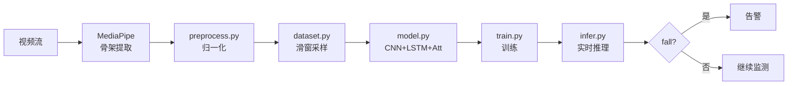

# 项目架构

## 整体设计

## 模块说明

### 数据层（src/preprocess.py, dataset.py）
- `normalize_skeleton`：以髋部中心为原点，躯干长度归一化
- `preprocess_dataset`：整体标准化到 (N, T, J, C)
- `SkeletonDataset`：PyTorch 数据集，平展为 (N, T, J*C)

### 模型层（src/model.py）
- **1D-CNN**：提取每帧的空间特征（17 关节 × 2 坐标 → 34 维 → hidden_dim）
- **LSTM**：时序建模，2 层
- **Attention Pool**：时序维度加权求和
- **Classifier**：hidden_dim → 64 → num_classes

### 训练层（src/train.py）
- CrossEntropy Loss
- Adam 优化器
- 学习率调度 + Early Stopping

### 评估层（src/evaluate.py）
- 二分类视角：跌倒 vs 非跌倒
- 重点指标：**FPR（误报率）**、**FNR（漏报率）**、F1

### 推理层（src/infer.py）
- 单样本前向推理
- 置信度阈值过滤
- 输出告警信号

## 数据流

1. **采集**：从摄像头或视频文件读取帧
2. **骨架提取**：MediaPipe Pose 输出 17 个关键点
3. **归一化**：以髋部中心为原点，按躯干长度缩放
4. **滑窗**：30 帧窗口（≈ 1 秒）
5. **推理**：模型输出 4 类概率
6. **决策**：若"跌倒"概率 > 0.85 触发告警

## 关键技术决策

| 决策 | 备选 | 选择 | 原因 |
|------|------|------|------|
| 骨架来源 | RGB / Depth / IMU | **MediaPipe** | 精度足够，部署简单 |
| 模型 | 3D-CNN / Transformer | **CNN+LSTM+Att** | 兼顾空间与时序，参数小 |
| 输入长度 | 16 / 30 / 60 帧 | **30 帧** | 1 秒窗口，跌倒动作完整 |
| 告警阈值 | 0.5 / 0.85 | **0.85** | 降低误报，宁漏勿错 |
| 部署平台 | 云端 / 边缘 | **边缘 (Jetson)** | 隐私 + 实时性 |

## 性能基线

在合成数据集上的示例结果：

| 指标 | 数值 |
|------|------|
| Accuracy | 99%+ |
| Precision | 99%+ |
| Recall | 99%+ |
| FPR | < 1% |
| FNR | < 1% |

> ⚠️ **重要**：示例数据为合成（src/generate_synthetic.py），真实场景需重新评估。
